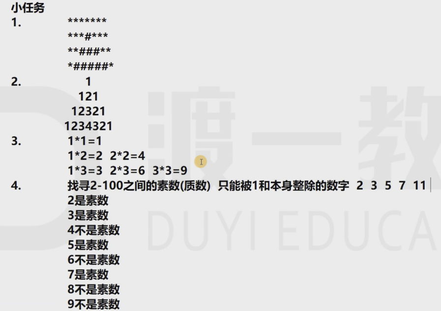

# eighth

补充一个乘方：```double value = Math.pow(double a,double b)```

注意：

他的返回值是double,他接收的参数也都需要是double类型的```double a = Math.pow(2,3)  结果是8.0```

## 循环嵌套

循环控制打印星星

1.一行打印任意颗星星


```java
System.out.print("你想要几颗星星？ ");
        Scanner input_1 =new Scanner(System.in);
        int count = input_1.nextInt();
        for(int i_1 = 1; i_1 <= count; i_1++){
            System.out.print("*");
        }
        System.out.println("");
```


2.行数和星星数都是用户给的


```java
System.out.println("请输入行数：");
        Scanner input_2 = new Scanner(System.in);
        int line_1 = input_2.nextInt();
        System.out.println("请输入星星的个数：");
        Scanner input_3 = new Scanner(System.in);
        int num_1 = input_3.nextInt();
        for(int x = 1; x <= line_1;x++){
            for(int y = 1; y<= num_1; y++){
                System.out.print("*");
            }
            System.out.println();
        }
```


3.输出4行，第一行1个第二行2个第三行3个第四行4个


```java
for(int x = 1; x <= 4; x++){
            for(int y = 1; y <=x; y++){
                System.out.print("*");
            }
            System.out.println();
        }
```


4.根据3.画一个右对齐的三角型


```java
for(int x = 1; x <= 4; x++){
            for(int y = 1; y <= (4-x);y++){
                System.out.print(" ");
            }
            for(int z = 1; z <= x; z++){
                System.out.print("*");
            }
            System.out.println();
        }
```


小任务：



任务1：


```java
public class task_homework{
    public static void main(String[] args){
        for(int x = 1; x <= 4; x++){
            if(i == 1){
                System.out.println("*******");
            }
            else{
            for(int y =1; y <= (5-x); y++){
                System.out.print("*");
            }
            for(int y = 1; y <= (7-2*(5-x)); y++){
                System.out.print(" ");
            }
            for(int y =1; y <= (5-x); y++){
                System.out.print("*");
            }
            }
            System.out.println();
            
        }
    }
}
```


任务2：


```java
public class task_homework{
    public static void main(String[] args){
        for(int x = 1; x <= 4; x++){
            for(int y = (4-x); y >= 1; y--){
                System.out.print(" ");
            }
            for(int y = 1; y <= x; y++){
                System.out.print(y);
            }
            for(int y = (x - 1); y >= 1; y--){
                System.out.print(y);
            }
            System.out.println();
        }
    }
}
```


任务3：


```java
for(int x = 1; x <= 9; x++){
            for(int y = 1; y <= x; y++){
                System.out.print(x+"*"+y+"="+(x*y)+"\t");
            }
            System.out.println();
        }
```


任务4：(需优化)


```java
public class task_homework{
    public static void main(String[] args){
        for(int x = 2; x <= 100; x++){
            int num = 0;
            if(x==2){
                System.out.println(x+"是素数");
            }
            else{
                for(int y = 2; y < x; y++) {
                    if (x % y == 0) {
                        System.out.println(x + "不是素数");
                        num = 1;
                        break;
                    }
                }
                if (num == 0){
                    System.out.println(x+"是素数");
                }
            }
        }
    }
}
```


补充：```\r(回车)  和  \n的去别```

\r 是结尾加换行，他占两个字节，而 \n只占一个字节

上面输出的九九乘法表，最后的空格换为\t，他会把每一个都当做表格来处理，就会对齐了


优化后的代码(放到一起了)


```java
import java.util.Scanner;
//加大上次小任务的难度(习题课)
public class firth {
    public static void main(String[] args){
        //行数由用户输入
        System.out.println("请输入行数：");
        Scanner input_1 = new Scanner(System.in);
        int line_1 = input_1.nextInt();
        for(int x = 1; x <= line_1; x++){
            if(x == 1){
                for(int y = 1; y <= (2*line_1 - 1); y++) {
                    System.out.print("*");
                }
            }
            else{
                for(int y = 1; y<= ((2*line_1-1)-(2*x-3))/2; y++){
                    System.out.print("*");
                }
                for(int y = 1; y<= (2*x-3); y++){
                    System.out.print(" ");
                }
                for(int y = 1; y<= ((2*line_1-1)-(2*x-3))/2; y++){
                    System.out.print("*");
                }
            }
            System.out.println();
        }
        //任务2的代码优化
        for(int line = 1; line <= 4; line++){
            for(int x = 1; x <= (4 - line);x++){
                System.out.print(" ");
            }
            for(int x = 1; x <= line; x++){
                System.out.print(x);
            }
            for(int x = line-1; x >= 1; x--){//优化改为 --
                System.out.print(x);
            }
            System.out.println();
        }
        //任务3  九九乘法表对齐的优化
        for(int x = 1; x <= 9; x++){
            for(int y = 1; y <= x; y++){
                System.out.print(y + "*" + x + "=" + (x*y) + "\t");
            }
            System.out.println();
        }
        //任务4 素数与否代码优化  1.标识换为boolean省内存    2.数的范围换为他的算数平方根

                for(int x = 2; x <= 100; x++){
                    boolean mark = true;
                    if(x==2){
                        System.out.println(x+"是素数");
                    }
                    else{
                        for(int y = 2; y < (int)(Math.pow(x,0.5)); y++) {
                            if (x % y == 0) {
                                System.out.println(x + "不是素数");
                                mark = false;
                                break;
                            }
                        }
                        if (mark == true){
                            System.out.println(x+"是素数");
                        }
                    }
                }
            }
        }

```