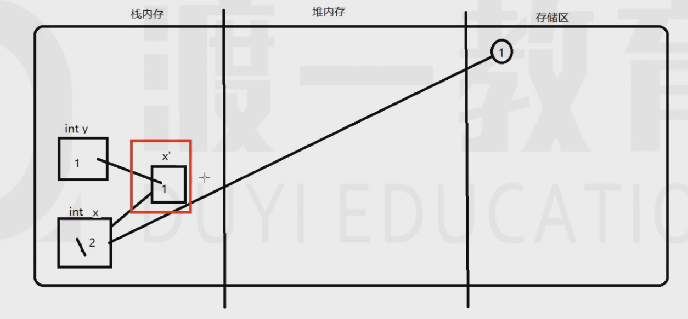

# forth

## 运算符号

三目运算符： ```(a>b)? x : y```

注意 ```int x = 5 ; x / 2 == 2  (不是2.5)```

```int x = 1; x = x + 1;```在计算机的执行过程：
先将1从x的存储空间中拿出来，在把另一个1从常量缓存区拿出来，相加后再存回x的空间中

能够自加在自减的，不仅仅有int型，浮点类型的也可以进行自加和自减

重点是下面第二个代码：

```java 
public class forth{
    public static void main(String[] args){
        int x = 1;
        int y = x++;
        System.out.println(y);
    }
}
```

变量赋值的过程：

都是先进行计算再赋值(就是先执行x++ 或者++x)
现将x变量空间的内容取出 从常量区中取出1 进行计算 再存回x空间
但是：
x想要做值交换的时候，会产生一个临时的副本空间(备份)
++在变量的前面 先自增再备份  ++ 在变量后面 先备份后自增
都是将副本空间内的值赋给其他的变量
备份赋值完成后就被销毁



然后再理解下面的这个代码

```java
public class forth{
    public static void main(String[] args){
        int a = 1;
        a = a++;
        System.out.println(a);
        //输出的值是1
    }
}
```

还有一个变形：

```java
public class forth{
    public static void main(String[] args){
        int a = 1;
        for(int i = 1; i <= 100; i++){
            a = a++;
        }
        System.out.println(a);
        //最后的值还是1
    }
}
```

看一道变态公司的笔试题：

```java
public class forth{
    public static void main(String[] args){
        int m = 1;
        int n = 2;
        int sum = m+++++n-n-----m+n-----m;
        //问题是m=? n=? sum=?
        //答案是0  1  2
    }
}
```
 
下面是一个编译通不过的代码：

```java
public class forth{
    public static void main(String[] args){
        byte a = 1;
        a = a + 3;
        //编译器就会报错
        //解决方法：将 a = a + 3; 换为 a += 3;
        //或者是 ：  a = (byte)(a + 3);
    }
}
```

分析原因：

1)对于```byte a = 1; a = a + 3;```:
    从a的变量空间取出  从常量区取来3 相加后再存回变量空间内
    对于“+”，在计算时，会进行自动类型提升，使得a变为int再进行相加，然后就存不到a的里面了
2)对于```byte a = 1;``` 和 ```byte a = 1;a += 3;```
    当等号右边是常量时，可以进行自动类型转换，而等号右边是个表达式时就不可以了(所以a = a + 3;就不能进行自动类型转换)