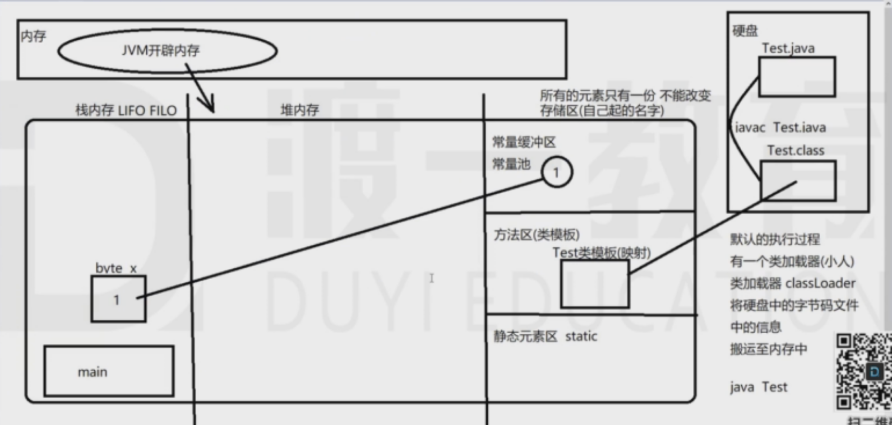

# second

## 解决编译出来的.class和.java文件名不同的问题

```java
public class first{
/*在前面加一个public 当后面的类名和文件名不一致的时候就会报错*/
    public static void main(String[] arg){
        System.out.println("hello world");
    }
}
```

## 数据类型

基本数据类型和引用数据类型

基本数据类型有8个：分为四个小类型
    整型(4) ：byte(字节型) short(短整型)  int(整型) long(长整形)
    浮点型(2) : float double    
    字符型(1) : char
    布尔型(1) : boolean

引用数据类型(可以自定义)
    数组[]  类class(包含了抽象类 abstract class) 接口 interface  枚举enum  注解@interface

基本数据类型：
- byte类型：字节型  占一个在字节 8位
    第一位用来表示符号  数值范围 -2的7次方~ 2的7次方-1(-128 ~ 127)
- short类型 两字节  16位(-32768  32767)
- int类型  四字节  32位(-2147483648 2147483647)
- long类型  八字节  64位

- float类型 四字节  32位  第一位 符号  剩下的9位  整数  剩下的 表示小数部分
- double类型 八字节 64位

- char类型  'a' '+' '我' '5'  都是字符型  2字节  16位
    英文和英文符号 一字节  
    中文和中文符号  两字节  char  用的是Unicode编码 (0 - 65535的范围) 

- boolean类型 只占一位  八分之一个字节 且不能和 0 1 发生转换(和C语言不同的地方)


## java 常量和变量

### 常量

常量表示程序在运行过程中不能再改变的值
常量的作用：1.固定的值 代表计算过程中经常用到的值，便于程序计算 2.用来代表一个含义

什么样的值算常量？
1.固定不变的值 是常量  1 2 'a'  
    所有基本类型的值 都是固定不变的
2.特殊的常量  "abc"  是string类型的  
    单引号是字符类型  双引号是字符串类型
    String是一个引用数据类型  他的值很特殊  可以简单的视为常量
3.自己创建的空间  存储一个值  让它固定 不能改变
    ```final int UP = 1```


###  变量

变量指的是在程序执行的过程中能够改变的量
变量指的是内存空间，在创建的时候就已经分配了内存，必须声明数据类型，里面存的可能是值或者是内存地址(引用)
变量名的命名规则：首字母小写，后面的单词首字母大写，遵循驼峰式命名法

- 变量的声明：
    ```数据类型 变量名;``` 
    ```String b;```
    ```int a;```

文档注释 ：用于解释 类   ```/** 这里是文档注释 */```

执行以下代码的过程：

```java
public class second{
    public static void main(String[] args){
        byte a = 1;
    }
}
```



下面的错误代码(无法通过编译)


```java
public class second{
    public static void main(String[] args){
        float a = 3.4;
    }
```

会报错： 不兼容的类型，double 到 float 可能有损失

原因：常量存储区，3.4是以double的形式存储的

解决方法： 
```float a = 3.4f ```或 ```double a = 3.4F```(建议使用F)

思考：常量1是32位存储的，而byte是8位，为什么下面的代码不报错？

```java
public class second{
    public static void main(String[] args){
        byte a = 1;
    }
}
```

解释： 赋值号在赋值的时候做了一个类型转换，把前面的24个0都砍掉了，如果前24位有一个1，编译就不会通过。
        但是float和double 不能自动转化。

下面的代码也无法通过编译：

```java
public second{
    public static void main(String[] args){
        long a = 2147483648;
        //已知2147483647为最大的int的数
    }
}
```

编译器汇报： 过大的数(编译器以为你是手误)

解决办法

```java
public second{
    public static void main(String[] args){
        long a = 2147483648L;//小写的L也可以，但是和1不好区分
    }
}
```

对于字符和字符串  字符中只能有一个，也不能空    字符串可以是空的