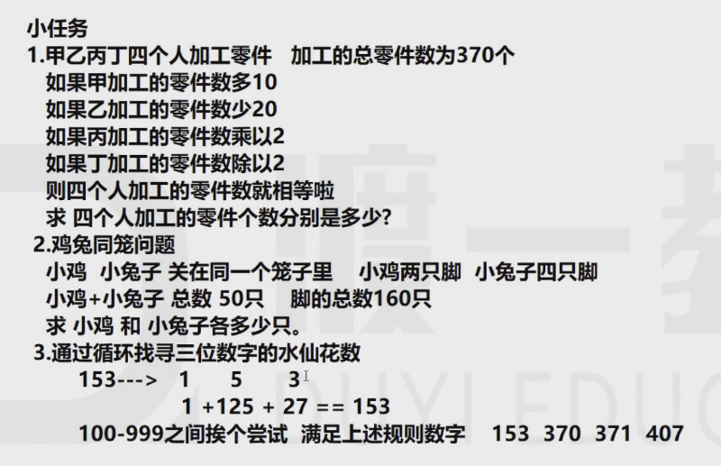

# seventh

## Java数据结构

### 循环结构

#### for循环：

要有：初始值、终点判定条件、变化量

```for(int i = 1; i<=100; i++){循环体}```

在for循环中定义的变量，再for循环后就销毁


```java
public class third{
    public static void main(String[] args){
        for(int i = 1; int <= 100; i++){
            int temp = 1;
            System.out.println(i);
            //这个i可以输出
        }
        System.out.println(i);
        //这个i就不能输出，它使得编译不能通过
        System.out.println(temp);
        //这个也不能正常输出，它也被销毁了，编译不能通过
    }
}
```


解决方法：


```java
public class third{
    public static void main(String[] args){
        int i = 1;
        for( ; i <= 100; i++){
            --skip--
        }
    }
}
```


理解下面的代码：


```java
public class third{
    public static void main(String[] args){
        int i = 1;
        for( ; i <= 5; i++){
            System.out.println(i++);
        }
        System.out.println(i);
        /*
        输出的结果是：
        1
        3
        5
        7
        */
    }
}
```


小任务：




任务1


```java
public class task_homework {
    public static void main(String[] args){
        int a,b,c,d;
        for(a = 1;a <= 370;a++){
            for(b = 1;b <= 370;b++){
                for(c = 1;c <= 370;c++){
                    for(d = 1;d <= 370;d++){
                        if(a+b+c+d == 370 && a+10 == b -20 && c*2 == d /2 && b-20 == c*2){
                            System.out.println("甲加工的零件数为："+a);
                            System.out.println("乙加工的零件数为："+b);
                            System.out.println("丙加工的零件数为："+c);
                            System.out.println("丁加工的零件数为："+d);
                        }
                    }
                }
            }
        }
    }
}

```


任务2：


```java
public class task_homework{
    public static void main(String[] args){
        for(int chicken = 1; chicken <= 50; chicken++){
            for(int rabbits = 1; rabbits <=50; rabbits++){
                if(chicken + rabbits == 50 && 2*chicken + 4*rabbits == 160){
                    System.out.println("鸡的数目是："+chicken);
                    System.out.println("兔子的数目是："+rabbits);
                }
            }
        }
    }
}
```


任务3：


```java
public class task_homework{
    public static void main(String[] args){
        for(int num = 100; num <= 999; num++){
            int hundred = num / 100;
            int ten = num / 10 % 10;
            int single = num % 10;
            int num_new = hundred*hundred*hundred + ten*ten*ten + single*single*single;
            if (num == num_new){
                System.out.println(num);
            }
        }
    }
}
```